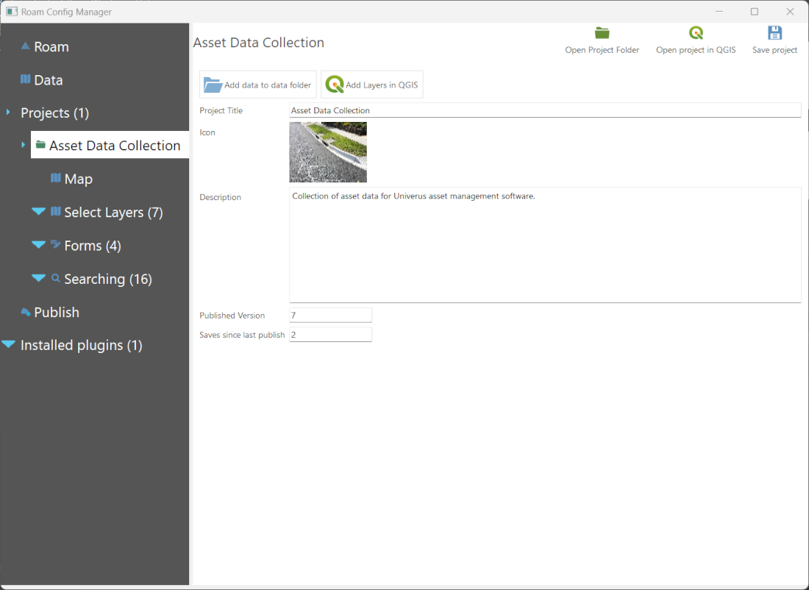
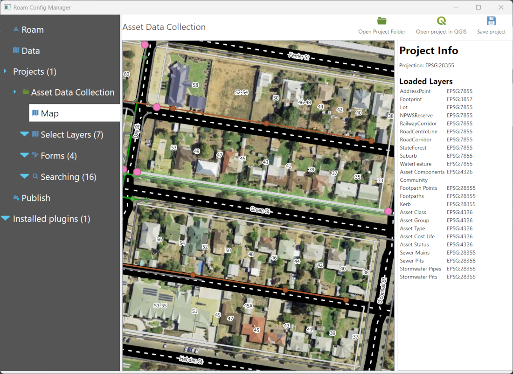
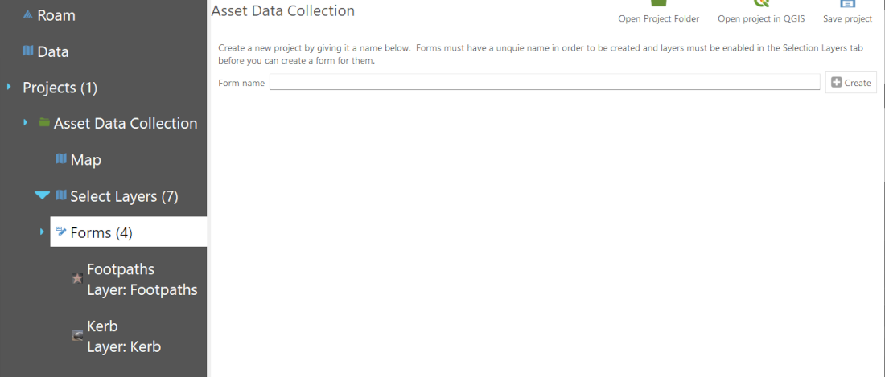
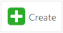
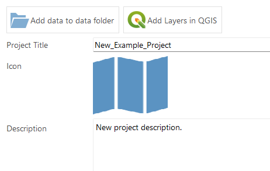
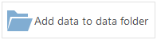
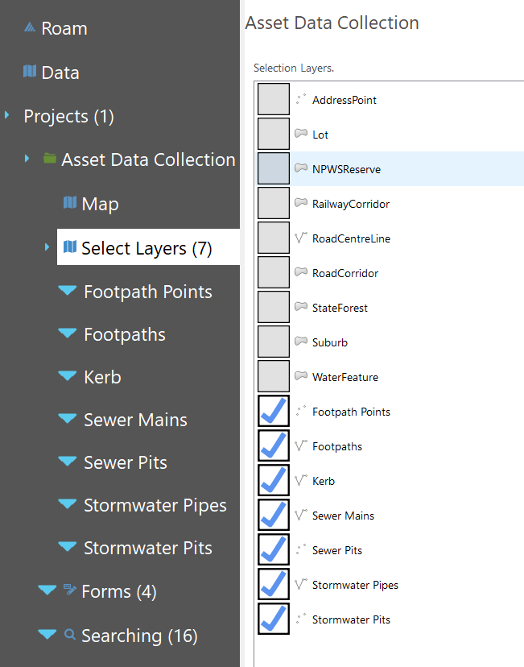
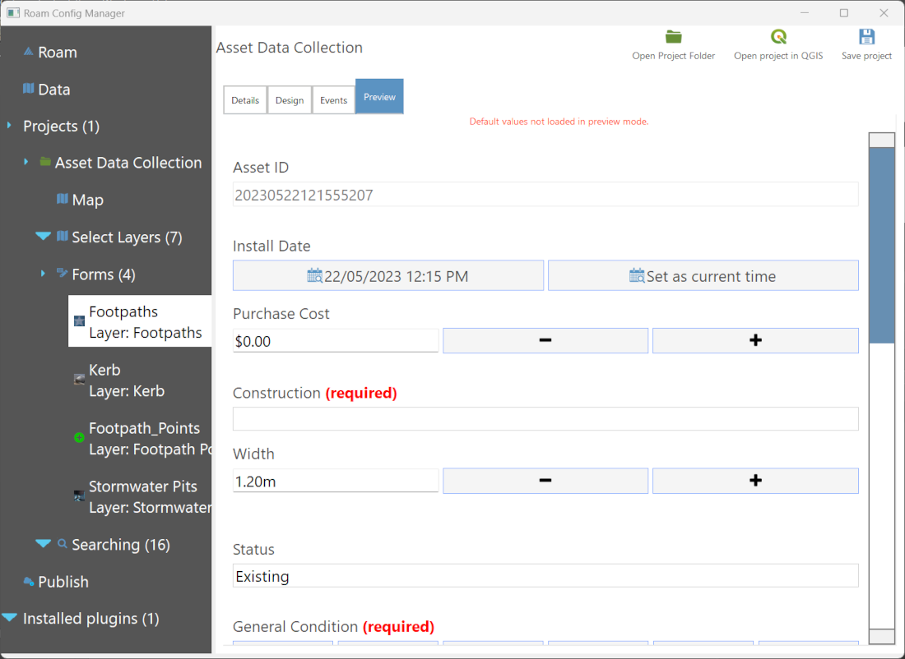

# Getting Started

The recommended way to create Roam projects is to use the Config Manager. The Config Manager will allow you to create and manage new projects and forms.

Open Config Manager by selecting `Config Manager` from the Windows Start Menu.

The tree view on the left side will list the available projects that Config Manager has found.  The Roam tree item will display the Config Manager main page with information about Roam itself and how to get started.

All projects that Roam finds in the `projects` folder will be listed under the Projects item. Selecting a project item will load the project allowing you to configure layers and forms for the project.

The map item under each Project folder will load a map view of the QGIS project this Roam project is using. The map view is for a quick reference about the project. 

Selecting the Forms item will allow you to create a new data entry form for Roam.  Data entry forms are supported for vector point, line and polygon layers.  If your QGIS project doesn't include any layers a note will be displayed explaining what to do.

!!!warning Note
Remember to always save your project using the Save Project button.
!!!

## Creating a new project

1. Select the Projects tree item.
1. Enter the name of the new project (eg. "Trees")
1. Click the add button. 
1. Roam will create a new project in the `projects` folder.
1. Edit the title and description.
!!!warning Note
Project name must be unique.  If a project name includes a space, Config Manager will replace the space with an underscore in the folder name.
!!!

## Changing the splash image

1. To change the splash image for a project, click the image (initially a folded map) in the `Icon` field.
1. Select the image you wish to replace the splash image with from your files system.  These files need to be either `.png` or `.svg` formats.  The file will be copied under the `project` folder as either `splash.png` or `splash.svg`.

## Adding data files

1. Click on the `Add data to data folder` button.  A Windows Explorer window will be open in the `_data` folder under `projects\{Your New Project}`. 
1. In order to make your Roam application mobile, data sources will generally need to be accessible locally on the tablet.  Storing data in the `_data` folder is a good practice to ensure data can be accessed by Roam.
1. Files in either `ESRI Shapefiles` or `Spatialite` file format are required for any layers that need to be edited in Roam.

!!!success
If you want to share data across multiple projects it is often a good idea to create a `_data` folder directly under the `projects` directory.  This avoids duplicating files on the tablet.
!!!

## Adding QGIS layers

1. Select the specific project node.  This will automatically be selected if you created a new project.
1. Click the `Open project in QGIS` button. .
1. Config Manager will watch for changes to the QGIS project.
1. QGIS will be loaded and you are able to add your own layers. **Remember to use the Save.. Project button in QGIS.**
1. Tell Config Manager to reload the QGIS project.

## Adding select layers

In Roam `Select Layers` are layers that are enabled for selection for using the select tool and will have attribute information displayed in Roam.  Any layers not ticked in the `Select Layers` list will be ignored.

1. Tick the box for each layer that should be selectable.  

Data entry forms can also only be added for enabled `Select Layers`.  Remember to tick the layer that you would like to use for data entry.

## Configuring select layers

1. To configure a `Select Layer` click on the specific layer under the `Select Layer` tree.
1. If the layer is to be used for data entry, choose the relevant options on this page.\

1. To configure selection information for a given layer, select the `Info 1` or `Info 2` option.
1. To just show the raw data from a layer, leave `This layer` selected.

1. For greater control of the information being shown SQL queries can be written, however this is only possible with layers from either `MS SQL` or `Spatialite` sources.

## Adding a new form

1. Select the Forms tree item
2. Select the Add New button 
3. Roam will ask for a new form folder name _Like projects Roam forms are based on folders_
4. Update the name of the form
5. Select the layer for data entry

### Adding attributes to the form

1. Select the Add Attribute button
2. Fill in the relevent fields for each attribute added
3. Select the contol type.

When a attributes control type changes it will also add an extra informtion that control needs.  For example, lists require more information before they can be created in Roam.

### Previewing the form

Forms can be previewed wihtout having to load Roam.  Simply use the Preview tab on the Form page to enable preview mode.  No defaults are loaded in preview mode but widgets will behave how they would when running Roam.

### Changing the form icon

Click the form icon in the form setup 

