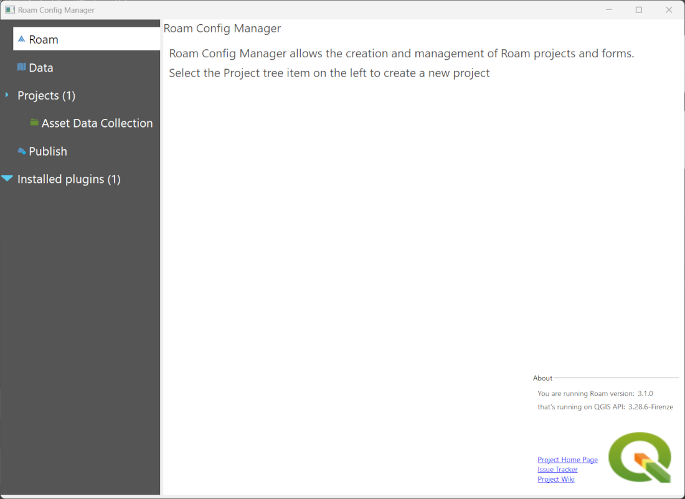
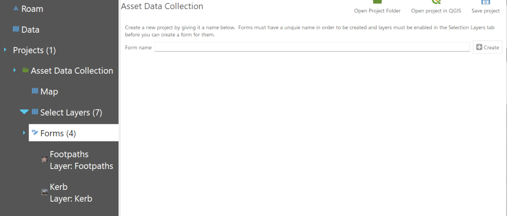
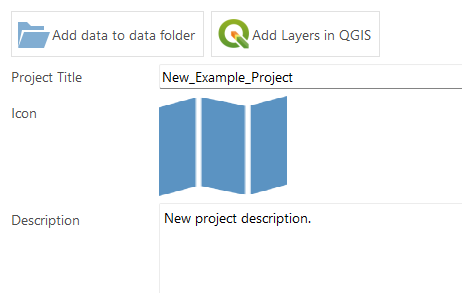
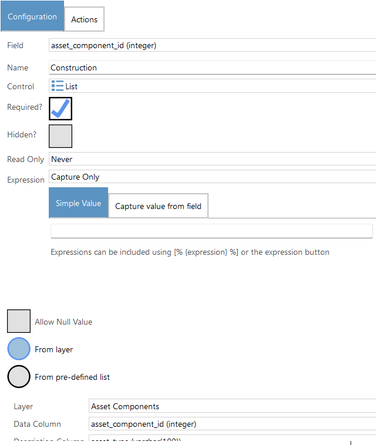

The recommended way to create Roam projects is to use the Conig Manager. The config manager will allow you to create and manage new projects and forms.

Open the Roam Config Manager using `Roam Config Manager.exe`

The tree view on the left side will list the available projects that Roam has found.  The Roam tree item will display the Roam Config Manager main page with information about Roam itself and how to get started.

All projects that Roam finds in the `projects` folder will be listed under the Projects item. Selecting a project item will load the project allowing you to configure layers and forms for the project.

The map item under each Project folder will load a map view of the QGIS project this Roam project is using. The map view is for a quick reference about the project. 

Selecting the Forms item will allow you to create a new data entry form for Roam.  Data entry forms are only supported on Point layers currently, however lines and polygons are planned.  If your QGIS project doesn't include any layers a note will be displayed explaining what to do.

**NOTE** Remember to always save your project using the Save Project button.

# Creating a new project

1. Select the Projects tree item
2. Click the add button 
3. The config manager will ask you for a new folder name. _All Roam projects are stored as folders in the `projects` folder. Folder names must be unique_
4. Roam will create a new project in the `projects` folder.
5. Edit the title and description.

## Adding QGIS layers
1. Select the project node.  Will be selected if you created a new project.
2. Click the Open In QGIS button .  Config manager will watch for changes to the QGIS project.
3. QGIS will be loaded and you are able to add your own layers. _Remember to use the Save.. Project button in QGIS_
4. Tell Config Manager to reload the QGIS project.

## Adding select layers
In Roam select layers are layers that are enabled for selection for using the select tool and will have attribute information displayed in Roam. Any layers not ticked in the Select Layers list will be ignored.

1. Tick the box for each layer that should be selectable  

Data entry forms can also only be added for enabled select layers.  Remember to tick the layer that you would like to do data entry on.

## Changing the splash image

Currently there is no way in the config manager to change the project splash however by clicking on the Open Project Folder button

you can replace the splash.png file with anything you like.  Roam uses splash.png as a convention so remember to always keep that name.

## Adding a new form
1. Select the Forms tree item
2. Select the Add New button 
3. Roam will ask for a new form folder name _Like projects Roam forms are based on folders_
4. Update the name of the form
5. Select the layer for data entry

### Adding attributes to the form
1. Select the Add Attribute button
2. Fill in the relevent fields for each attribute added
3. Select the contol type.

When a attributes control type changes it will also add an extra informtion that control needs.  For example, lists require more information before they can be created in Roam.

### Previewing the form

Forms can be previewed wihtout having to load Roam.  Simply use the Preview tab on the Form page to enable preview mode.  No defaults are loaded in preview mode but widgets will behave how they would when running Roam.

### Changing the form icon

Click the form icon in the form setup 

