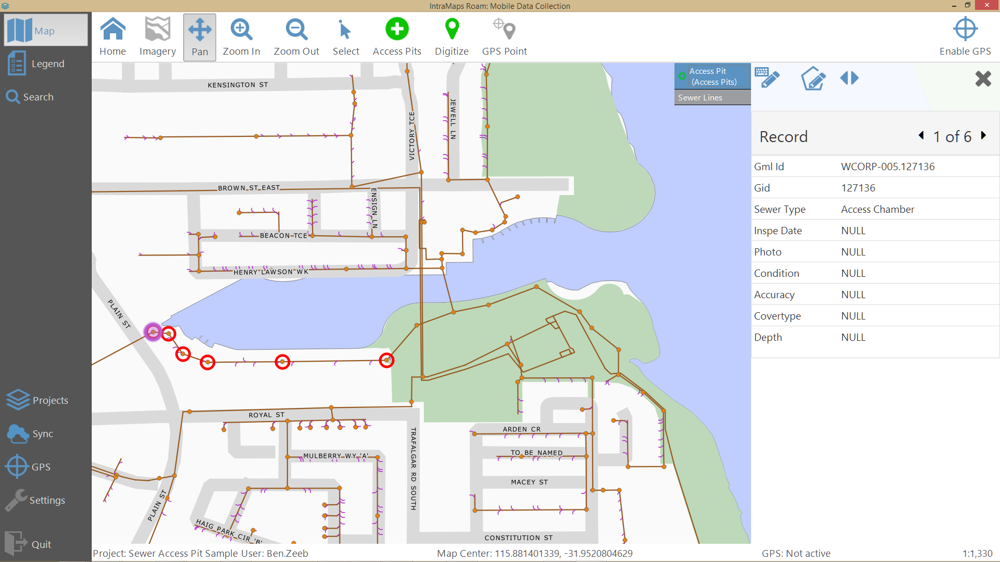
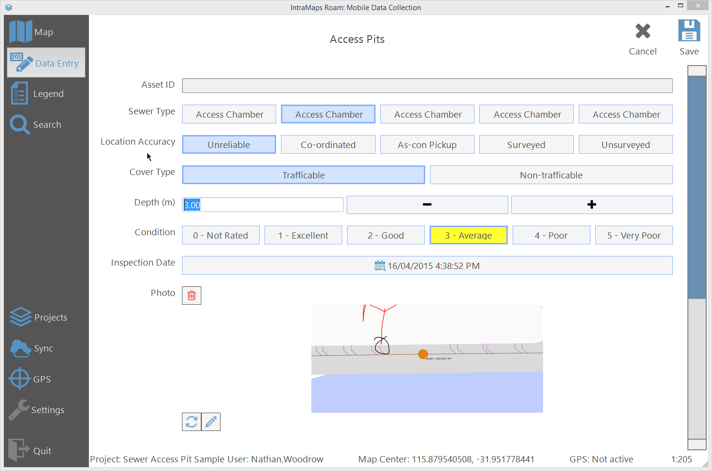

# Roam

[Download the latest release (3.1 Beta)](https://github.com/terry-longmacch/Roam/releases)

[View the change log for 3.1](features/Features-3.1.md)

[Grab the source](https://github.com/terry-longmacch/Roam)

Roam is a simple data collection application built using QGIS. 
Roam is built as a standalone fully packaged Python application with everything included. 
QGIS is **not** required to be installed on the users machines.

## Quick Start

- Download and install the latest [release](https://github.com/terry-longmacch/Roam/releases)
- Run `Roam Config Manager.exe`
- Create a project and some forms by following the [creating a project guide](admin-guide/projectadmin.md)
- Run `Roam.exe`
